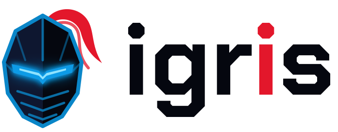
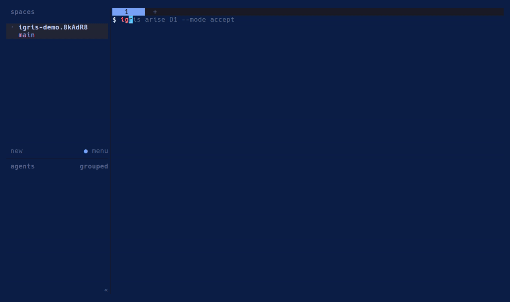
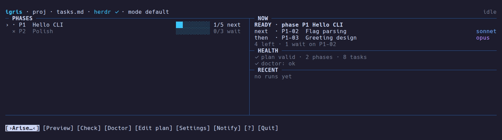

<h1 align="center">
  <picture>
    <source media="(prefers-color-scheme: dark)" srcset="docs/brand/igris-logo-dark.svg">
    
  </picture>
</h1>

<p align="center"><em>Arise.</em> One task, one fresh session, the right rank.</p>

<p align="center">
  <a href="https://github.com/drilonrecica/igris/actions/workflows/ci.yml"></a>
  <a href="https://github.com/drilonrecica/igris/releases/latest"></a>
  <a href="https://pkg.go.dev/github.com/drilonrecica/igris"></a>
  <a href="LICENSE"></a>
</p>

<p align="center"><strong><a href="https://drilonrecica.github.io/igris/">drilonrecica.github.io/igris</a></strong></p>

<p align="center"></p>

**igris** runs the tasks in your markdown project plan **one at a time**, each in a **fresh Claude Code session**, started with **exactly the model your plan assigns to that task**.

You write the plan. You decide which tasks need Fable, which need Opus and which are fine on Sonnet. Igris makes sure that's what actually happens: it never runs a Sonnet task on a more expensive model, never lets one task's context bleed into the next, and stops to wait for you whenever a task needs a decision.

> **Status:** v0.4.0. Linux and macOS, Windows through WSL2; runs in herdr or tmux. The full behavior is specified in [`SPEC.md`](SPEC.md).

---

## Why

Long Claude Code sessions fill their context and drift. Picking the model by hand for every task is tedious and easy to get wrong, and the expensive mistake is the silent one: a routine task quietly running on your most expensive model.

If you already plan your work as a task table with dependencies and a model per task, igris turns that plan into an execution queue:

```
igris arise M0
```

1. Takes the first ready task in phase `M0`.
2. Opens a new pane and starts Claude Code with that task's model (`--model sonnet`, `opus`, `fable`, …).
3. Hands it the task, the plan and your project rules.
4. If Claude needs you — a decision, an approval, a plan to review — igris waits and notifies you.
5. When the task is truly done, Claude runs `igris done M0-03`. Igris optionally runs your checks, offers to commit, marks the task `done`, unblocks dependents, closes the session.
6. Starts a fresh session for the next task. Repeat until the phase is finished.

Strictly sequential. Deterministic. No LLM decides which model runs what.

## Shadows have ranks

Like summoning the right shadow for the fight, each task gets the rank your plan gives it:

| Rank (your plan) | Typical use | Claude Code model |
|---|---|---|
| `sonnet` | routine, well-specified work | `--model sonnet` |
| `opus` | complex or security-sensitive logic | `--model opus` |
| `fable` | the highest-stakes design and correctness work | `--model fable` |

Rank aliases are configurable in `igris.toml`. Every key is optional; unknown keys are rejected so typos don't go unnoticed, and secrets such as the ntfy token can be given as `env:VAR_NAME` instead of being written in the file.

## Requirements

- **Claude Code**, logged in with your subscription (Pro/Max) or however you normally use it. Igris starts ordinary interactive sessions, so it uses your normal login and limits.
  > If `ANTHROPIC_API_KEY` is set in your environment, Claude Code bills the API instead of your subscription. Igris warns you about this at start.
- **[herdr](https://herdr.dev) or [tmux](https://github.com/tmux/tmux) 3.2+** — igris runs each session in a herdr tab or a tmux window, so everything survives disconnects and you can reconnect over SSH (e.g. from your phone). See [herdr setup](#herdr-setup) and [tmux setup](#tmux-setup).
- **git** (recommended): igris can commit after each task and warns when the tree is dirty.
- Linux or macOS (amd64 or arm64). On Windows, use WSL2: see [Windows (WSL2)](#windows-wsl2).

igris is verified with Claude Code 2.1.291, herdr 0.9.1 and tmux 3.2 or later. `igris check` and `igris arise` warn when Claude Code or the backend you run in is missing, older, or a newer major version; they never refuse to run because of it.

## Install

With Homebrew (Linux and macOS):

```sh
brew install drilonrecica/tap/igris
```

With Go (the version pinned in `go.mod` or newer):

```sh
go install github.com/drilonrecica/igris/cmd/igris@latest
```

Or download a prebuilt binary from the [Releases](https://github.com/drilonrecica/igris/releases) page: `igris_<version>_<os>_<arch>.tar.gz` for linux and darwin on amd64 and arm64. Check the download against `checksums.txt` (SHA-256), then put the binary on your `PATH`:

```sh
sha256sum --ignore-missing -c checksums.txt    # macOS: shasum -a 256 --ignore-missing -c checksums.txt
tar xzf igris_<version>_<os>_<arch>.tar.gz
install -m 755 igris ~/.local/bin/igris
igris version
```

The binaries are static and not signed yet; the checksums guard against a corrupted download.

## Shell completion

`igris completion bash|zsh|fish` prints a completion script for subcommands, flags, and phase and task IDs from your plan (read from `tasks.md` or the `plan` in `igris.toml` of the current directory; nothing is offered while the plan is invalid).

```sh
# bash: add to ~/.bashrc
source <(igris completion bash)

# zsh: add to ~/.zshrc, after compinit
source <(igris completion zsh)

# fish: install once
igris completion fish > ~/.config/fish/completions/igris.fish
```

## herdr setup

Igris starts every Claude Code session in its own herdr tab, so `igris arise` must run **inside a herdr pane** with the herdr server running:

1. Install [herdr](https://herdr.dev) and start it (`herdr`), ideally on the machine where your project lives; reconnect over SSH whenever you like and everything is still running.
2. Optional: `herdr integration install claude`, so herdr itself also shows Claude's state. igris doesn't need it: it reads the agent state from Claude Code hooks (see [How igris knows what Claude is doing](#how-igris-knows-what-claude-is-doing)).
3. In a herdr pane, `cd` to your project and run igris (see Quick start).

## tmux setup

Igris also runs inside [tmux](https://github.com/tmux/tmux) 3.2 or newer. Each Claude Code session opens in its own tmux window, in the background, named `<task> · <rank>`:

1. Install tmux and start it (`tmux`, or `tmux new -s work`); detach with `ctrl+b d` and reattach later, also over SSH, with `tmux attach`.
2. In a tmux window, `cd` to your project and run igris (see Quick start).
3. Press `o` in igris (or `ctrl+b` and the window number) to switch to a session's window, and come back to igris's window the same way.

Igris's toasts show in tmux's status line; ntfy or Discord reach you when you're away. When a session's Claude Code exits, its window stays open (dead) so you can see why, until igris closes it.

## Which backend: `backend = "auto"`

`igris init` writes `backend = "auto"`: igris uses herdr when it runs inside a herdr pane, else tmux when it runs inside tmux. Set `backend = "herdr"` or `backend = "tmux"` in `igris.toml` to pin one. Outside both, `igris arise` exits and says where to run it. `init`, `check`, `phases`, `status`, `history`, `done`, `skip` and `notify test` need neither (`adapt` does). An interrupted run resumed under the other backend can't reattach its session; igris then offers the usual choices (continue the conversation, start fresh, done, skip).

## How igris knows what Claude is doing

Igris starts every session with `--settings .igris/hooks/<task>.settings.json`, a Claude Code settings file that contains only hooks. They run the hidden `igris hook` command on Claude's lifecycle events (prompt submitted, tool use, permission prompt or question, turn finished, session ended), which records the session's state in `.igris/agent-state/`. That is how igris knows a session is working, waiting for you or idle, without screen-scraping, in tmux and in herdr without its integration (with the integration, herdr's own state wins). Nothing is added to your `.claude/` settings, and your own Claude sessions are unaffected. The state only drives **Needs you**; a task still advances only on `igris done` or your action.

## Windows (WSL2)

igris doesn't run natively on Windows. It runs inside [WSL2](https://learn.microsoft.com/windows/wsl/install), like herdr and Claude Code:

1. Install WSL2 with a Linux distribution (Ubuntu is fine) and open it in Windows Terminal.
2. **Inside WSL**, install herdr, Claude Code and igris (the `linux_amd64` binary, or `linux_arm64` on ARM), as described above. Don't mix them: an igris in WSL can't drive a Claude Code or herdr installed on the Windows side.
3. Keep the project in the Linux filesystem (`~/code/…`), not under `/mnt/c`. Files on the Windows drive are much slower from WSL, and Windows tools touching the same checkout (an IDE's git, `core.autocrlf`) make for surprising diffs. If your editor is on Windows, open the WSL folder through `\\wsl$\` or VS Code's WSL extension.

Plans and `igris.toml` saved by Windows editors work: CRLF line endings and a UTF-8 byte order mark are fine, and igris keeps both when it writes a Status cell. Windows Terminal supports the colors and mouse input the TUI uses.

So far WSL2 support has been tested by reproducing these conditions on Linux (`docs/check-wsl.md`), not yet on a real Windows machine. Reports, good or bad, are welcome in an issue.

## Quick start

Run `igris` in a terminal and the [home screen](#home-screen) walks you through the same steps. On the command line:

```sh
cd your-project
igris init          # creates igris.toml and .igris/, ignores .igris/ in git, allows `igris done` for Claude
igris doctor        # is everything in place? one line per check, the fix command for each problem
igris check         # validates your plan
igris status        # shows phases, tasks, what's ready and what's blocked
igris arise M0      # runs phase M0 (inside a herdr pane or tmux)
igris history       # past runs: tasks done and skipped, durations, verify attempts, commits
```

The first session in a folder Claude Code hasn't seen waits on its own folder-trust prompt ("Is this a project you trust?"). Igris can't answer it for you: the task sits there, and after about 30 seconds igris shows **needs you: the agent is blocked**. Open the session (`o` in the TUI), answer the prompt once, and the task carries on. Later sessions in that folder don't ask again.

`igris arise M0 --dry-run` shows the launch order with each task's model, mode and verify profile (and whether task hooks would run) without starting anything or writing a byte. `igris arise M0 --no-tui` runs with plain log lines instead of the TUI and reads your answers and commands from stdin (`y`/`n`, `reset yes|no` for a reset request, `done [note]`, `skip <reason>`, `retry [continue|fresh]`, `pause`, `stop`, `mode [task] <m>`, `help`).

To run part of the phases, name the tasks: `igris arise --only M1-03,M1-05` runs just those, `--from M1-03` starts at a task and `--until M2-02` stops after one (`--from` and `--until` combine; `--only` doesn't combine with them). Without a phase the range comes from the tasks you name (`--through` still sets the last phase); with one, every named task must lie inside it and `--through`. A wrong ID, a task outside the range or a `--from` after the `--until` stops `arise` before it asks or writes anything. Tasks still run in plan order and dependencies still count: a task of the slice that waits on unfinished work is reported as `not run: M1-05 waits on M1-04 (ready, phase M1)`, never marked, and the run goes on; that is not a stuck phase. An interrupted task from an earlier run is still picked up first, even outside the slice. A bare `igris arise` resumes the same slice, and `--dry-run` walks it.

`igris doctor` checks the machine and the project without changing anything (it never writes or creates `.igris/`, and has no `--fix`): Claude Code, the backend (herdr or tmux: version, whether igris runs inside it), `ANTHROPIC_API_KEY`, git, `igris.toml` and the plan (every problem), the `igris done` allow rules in `.claude/settings.local.json` (and a warning if `igris skip` is allowed there), the modes of `.igris/`, a stale or foreign lock, a project under `/mnt/` (WSL), and whether a notification channel is set up (nothing is sent; `igris notify test` sends). Each line is `ok`, `warn` or `fail`; a problem is followed by the command that fixes it. It exits 1 only if some check is `fail`, works outside a project, and `--json` prints the results as an array. Not running inside herdr or tmux is a `warn` here, since you usually run `doctor` from a plain shell.

`igris history [TASK-ID] [-n N] [--json]` lists the last N runs (default 10, newest first) from `.igris/runs.jsonl`: phases, tasks done and skipped, how long each task took, verify attempts, commits and how the run ended (`completed`, `stuck`, `stopped`, `error`, or `interrupted` when it has no stop event). With a task ID it lists every attempt of that task across all runs. It is read-only: it takes no lock and never creates `.igris/`, and it ignores a truncated last line.

Before a run starts, igris warns if `ANTHROPIC_API_KEY` is set (your sessions would bill the API, not your subscription; it asks you to confirm), if the project isn't a git repository, or if the tree has uncommitted changes.

`igris init` is safe to re-run: it never overwrites an existing `igris.toml`, appends to `.gitignore` only if `.igris/` isn't ignored yet, and merges the `Bash(igris done:*)` allow rule into `.claude/settings.local.json` without touching your other settings. `igris init --example` also writes the example plan as your configured plan path when there is none (it prints `kept tasks.md` and leaves an existing plan alone). `igris skip` is deliberately not allowed, so a session that wants to skip has to ask you.

`status` keeps showing the last run's `Run` block after you quit igris (`Lock none`, the task it was on): that is the resume state, and `igris arise` with no phase picks it up. A task's duration includes the time it waited for you, so it isn't a measure of agent time.

`check`, `phases` and `status` read your plan without changing it. Each takes `--plan PATH` (default: `plan` in `igris.toml`, else `tasks.md`) and `--json`. `check` exits 0 for a valid plan, 1 for an invalid one, and warns when `ready`/`blocked` cells don't match the dependencies, when `ANTHROPIC_API_KEY` is set, and when you run it from a subfolder of a project (it reads `igris.toml` only from the current folder). `check --strict` also lints the plan and exits 1 on any plan or config warning, which suits CI: a Task cell without a `**bold**` title or longer than 400 characters, an `agent + user` row that never says what the owner does, a `-G` gate task that doesn't depend on every other task of its phase, a `yolo` Mode cell, and a `fable` task that is the only heavy-rank (opus or fable) task of its phase. Done and skipped tasks aren't linted. Drift, ignored columns and config warnings fail it too; machine warnings (Claude Code or backend versions, `ANTHROPIC_API_KEY`, an `igris.toml` in a parent folder) are printed but never do, so it runs without Claude Code installed. With `--json` the document gets `"strict": true` and each lint warning a `"lint"` name. Plain `check` never shows these hints; `phases` lists task counts per phase; `status [PHASE]` lists tasks with rank, owner and what each is waiting on, under a short "Run" block (phases, current task, mode, since, session, lock, pending signals) when a run exists in the project (`--json`: a `run` object, absent when there is none). The run is read from `.igris/` of the project root found upward from the current folder; an unreadable `state.json` is reported there, not as a failure.

`igris arise`, `adapt` and `notify test` also find the nearest `igris.toml` or `.igris/`; a folder with neither works only if it has your `tasks.md`, otherwise igris asks you to run `igris init` and creates nothing. `igris done ID [--note TEXT]` and `igris skip ID --reason TEXT` work from anywhere inside the project (igris finds the nearest `igris.toml` or `.igris/`). They only drop a signal file in `.igris/signals/`; the running `igris arise` applies it. A signal for a task that isn't the current one is kept and shown, never applied. A `skip` from an agent session is only a request: igris asks you to confirm it.

`igris reset ID [--force]` puts a task back to `ready` (or `blocked`, if a dependency is unfinished), e.g. to run it again. It works on a task `in progress`, and with `--force` on a `done` or `skipped` one; a `ready` or `blocked` task has nothing to reset. User tasks work the same way. With no igris running, it rewrites the Status cell itself (and any `ready`/`blocked` cells that follow from it) and says so: `M1-03: in progress → ready`; if that task was the one an interrupted run was working on, close its session by hand. While igris runs here, it hands the reset to that run as a request (`M1-03: reset requested; confirm it in the running igris`): that run asks you **Reset M1-03?** (with `--no-tui`, type `reset yes` or `reset no`), because a session could write the same request, and applies it only once you confirm, never in the middle of a verify or a commit. A reset requested while the task is being verified or committed is answered before the task is accepted, so it is never lost behind its done. A request still waiting when igris stops is asked about at the next `igris arise`. Resetting the task igris is working on closes its session and turns **pause after task** on, so it doesn't just start again; press `p` to continue. A run on another host can't be reached: reset there, or clear its lock with `igris arise --force-unlock`. Tasks in progress that depend on the reset one are listed and left as they are. The run log gets a `task_reset` entry.

Each session gets two prompts: fixed igris rules (one task only, never touch Status, run `igris done` last) passed as a system-prompt file, and a first message built from a template. Set `prompt_template` in `igris.toml` to your own Go template to replace the default message; the variables are listed in SPEC §6.1.

`igris arise` needs herdr or tmux (see [herdr setup](#herdr-setup), [tmux setup](#tmux-setup)); `check`, `status`, `done` and `skip` work without them.

## Your plan

A plan is a markdown file (default `tasks.md`) with one task table per `##` phase:

```markdown
## M0 — Repository foundation

| ID | Task | Deps | Status | Model | Owner |
|---|---|---|---|---|---|
| M0-01 | **Go module** — init module, pin Go version | — | ready | sonnet | agent |
| M0-02 | **Entrypoint** — main.go with subcommands | M0-01 | blocked | sonnet | agent |
| M0-03 | **Crypto envelope** — versioned secret format | M0-01 | blocked | opus | agent |
| M0-04 | **Create GitHub repo** | — | ready | — | user |
| M0-G | **M0 gate** — owner smoke test | M0-01…M0-04 | blocked | sonnet | agent + user |
```

- **Deps:** comma-separated IDs or ranges (`M0-01…M0-04`), across phases too. If your column has another name (`Depends`, `Depends on`, …), alias it in `igris.toml` (`[columns]` with `"Depends" = "Deps"`); otherwise igris reads no dependencies from it, and `igris check` warns about that.
- **Status:** `ready`, `blocked`, `in progress`, `done`, `skipped`. Igris keeps this column up to date and touches nothing else in the file.
- **Owner:** `agent`, `agent + user` (the agent must get your decision or sign-off), or `user` (your own task: igris pauses until you mark it done). The card then says **YOUR TURN — yours to do outside igris (no session). Then: d done · s skip**: do the work yourself, wherever it happens, and press `d` (it asks for an optional note, e.g. the name you picked, which lands in `igris history`) or `s` to skip with a reason. `igris done ID --note …` / `igris skip ID --reason …` work from any terminal too.
- **Blocked on something outside the plan?** (API keys from a client, a deploy, a date) Add a `user` task that names the blocker and make the waiting task depend on it, e.g. `| X-00 | **Wait for API keys from client** | — | ready | — | user |`. Igris notifies you when it is your turn and carries on once you mark that task done. There is no other way to say "waiting on the outside"; `igris adapt` turns prose like "waits on" or "blocked by deploy" into such a task and lists it under `## Adapt notes`.
- **Optional `Mode` column** to force a mode per task (e.g. `plan` for design-heavy tasks).
- **Optional `Verify` column** naming a verify profile from `igris.toml` (`fast`, `full`, …) for that task, or `none` to skip verification for it; `—` or an empty cell falls back to the phase's and the project's default (see [Verification and commits](#verification-and-commits)). It names profiles, never commands.
- **Optional `Timeout` column**: a Go duration (`45m`, `1h30m`). When a session runs longer than that, igris marks the task **overdue** on the card and **Needs you**, logs `task_overdue` and sends a `task_overdue` notification, once per session; it never stops or closes the session. The clock starts when igris sends the session its first prompt (or reattaches to it after a restart), and a retry starts a new one. Anything that isn't a duration greater than zero fails `igris check`.
- **Optional `Context` column**: comma-separated repo-relative paths (files or directories, at most 20) the session must read before changing anything, e.g. `` `docs/auth.md`, internal/auth/ ``. The default task prompt lists them under **Required reading**, and custom templates get them as `.Context`; igris names the paths only and never reads or sends their contents. Each path must exist and stay inside the project: absolute paths, `..` and symlinks leading out of it fail `igris check` and `igris arise` (checked against the project root, or the working directory for `check`, `phases` and `status`).
- On a `user` task, Verify, Timeout and Context are ignored, and `igris check` warns about each one that is set. These three cells are checked only on tasks that are not `done` or `skipped`. `igris status` shows a VERIFY, TIMEOUT or CONTEXT column only when some task sets it.

A complete small plan is in [`examples/tasks.md`](examples/tasks.md) and a commented config in [`examples/igris.toml`](examples/igris.toml); copy them and run `igris check` and `igris arise P1 --dry-run` to see how igris reads them. [`examples/advanced/`](examples/advanced/) is the same plan with Verify profiles, Timeouts and Context paths, and the `igris.toml` that defines its profiles.

### Different format? `igris adapt`

`igris adapt` converts a plan igris can't read into the canonical format. It opens one Claude Code session (in herdr or tmux, mode default) with `adapt.model` from `igris.toml` (`sonnet` by default; `--model opus` for a hard one) and `--plan PATH` for a plan other than the configured one. The session gets the format, `igris check`'s complaints, your `[models]` and the names of your verify profiles (never their commands), writes the converted copy to `.igris/adapt/<plan>.proposed.md`, and finishes with `igris done ADAPT`. It may ask you things in its pane, like any igris session.

It keeps every task, ID, description, dependency, status and model; it only restructures. It never invents models: a task without a usable one gets Model `?` and is listed under `## Adapt notes` at the end, and `igris check` keeps rejecting it until you fill it in. Verify, Timeout and Context cells are kept as written and never invented; a column of one of those names that holds something else (a command under Verify, say) is renamed so it stays an extra column, and noted. When the session is done, igris validates the proposal and opens a review of what the proposal changes, with the `igris check` result and any problems on top. When your plan already has task tables, the review compares them table by table — tasks by ID, cells by column name — and lists only what changed: added (`+`) and removed (`-`) phases, tasks and columns, and one `~` line per changed cell (`M2-04 Deps: "M2-01" → "M2-01, M2-03"`), renamed column or new column order, followed by a line diff of the text outside the tables. Otherwise it is a line diff of the two files (`-` removed, `+` added, long unchanged stretches folded). Scroll with the arrow keys, `pgup`/`pgdn` or the wheel. **Reject** has the focus first, so `enter` changes nothing; `a` or **Accept** replaces your plan after backing it up to `.igris/adapt/<plan>.<timestamp>.bak.md`, and `r`, `esc` or `q` reject (the proposal stays in `.igris/adapt/` for reference). A proposal that doesn't pass `check` yet, e.g. with models left at `?`, asks once more before it replaces anything, and igris then lists what is left to fix. If the plan changed on disk while you reviewed, nothing is replaced. `adapt` can't run while `igris arise` runs in the project, and `Ctrl-C` stops waiting without closing the session.

## Verification and commits

Set `verify` in `igris.toml` (e.g. `verify = "make fmt lint test"`) and igris runs it each time a session says it's done.

Different tasks can verify differently with **verify profiles**: name shell commands under `[verify]`, give a phase its own default with `[phases.<id>]`, and pick one per task with the plan's `Verify` column:

```toml
[run]
verify = "make fmt lint test"        # the profile "default"

[verify]
fast = "go test ./internal/plan/..."

[phases.M0]
verify = "fast"                      # or "none": no verification for this phase's tasks
```

For each task igris uses its Verify cell, else `[phases.<id>] verify` for its phase, else `default`; `none` at either of the first two levels turns verification off, and with nothing set there is none. Profile names use `a-z`, `0-9`, `_` and `-`; `none` is reserved, and `run.verify` together with `[verify] default` is an error. A Verify cell naming an unknown profile fails `igris check` and `igris arise`; a `[phases.<id>]` naming no phase of the plan is a warning. `verify_timeout` and `verify_max_attempts` apply to every profile, the failure sent into the session names the profile, and `igris arise --dry-run` shows each task's profile. When it fails, the last 60 lines go back into the same session to fix (as plain text: escape sequences are stripped); after `verify_max_attempts` failures in a row igris calls you instead. If you mark a task done yourself, igris takes your word and skips verify. Keep in mind that `verify` runs your project's own code, as you: a session that can edit files can change what it does.

After a task passes, igris commits everything in the tree (`commit = "ask"`, the default, asks you first; `auto` just commits; `never` leaves git alone). The message comes from `commit_message`, `{{.ID}}: {{.Title}}` by default, with the session's done note as the body.

### Task hooks

`[hooks]` runs your own commands around every agent session, for example to start a dev database before a task and report its result after:

```toml
[hooks]
before_task = ["./scripts/dev-db", "up"]   # argv list: no shell, no globbing, no pipes
after_task = ["./scripts/post-status"]
timeout = "2m"                             # per hook run, the default
```

Each hook runs in the project root with your environment plus `IGRIS_TASK_ID`, `IGRIS_PHASE`, `IGRIS_RANK` (the plan's rank), `IGRIS_MODEL` (the resolved `--model` value) and, for `after_task`, `IGRIS_RESULT` (`done` or `skipped`). Hooks run for agent tasks only, never for user tasks or `adapt`, and `igris arise --dry-run` only says they would run.

- `before_task` runs after the task is marked `in progress` and before its pane opens, for every session igris opens (also a retry); not when igris reattaches to a live session. If it fails (non-zero exit, timeout, or it can't be started), no session is opened: the task stays `in progress`, igris shows **Needs you** and sends `run_error`, and you choose to retry (which runs the hook again), mark the task done, skip it, or stop.
- `after_task` runs once the task is marked `done` or `skipped` and its session is closed. A failure is a warning plus a `run_error` notification; the run goes on. It doesn't run for a task you reset, or one a stop leaves `in progress`.

The log shows when each hook starts. A hook passes when it exits 0, also if it leaves a helper running in the background; igris waits up to 2 s for the hook's output to close and drops what the helper prints after that, so redirect a background helper's output. On a failure the log (TUI and `--no-tui`) shows the last 20 lines of the hook's output (escape sequences stripped); the run log and notifications only get the short reason, such as `before_task hook failed: exit status 1` (or `timed out after 2m`, `not found`, `killed by signal 9 (killed)`, `can't start it`), never the command line. An empty list means no hook; the first element is the program, and no element may contain a control character.

## Modes

Choose the permission mode in the TUI, per run or per task: press `m` (or click **Mode**) for the run, or select a task and press `M` (**Task mode**) to override it for that task (user tasks have no session, so they have no mode to set). A change applies to the next session; a running one keeps its mode. A task's mode is, in order: your override, its `Mode` column, the run mode, `default_mode` in `igris.toml` (`auto` unless you set it: Claude Code approves routine actions itself and asks you about risky ones; set `default_mode = "default"` to get every permission prompt). `claude.extra_args` can't carry model, mode, session or settings flags (`--model`, `--permission-mode`, `--settings`, `-c`/`-r`, …); igris sets those itself and rejects a config that has them. `claude.command` is deprecated and ignored (igris always starts `claude` from your `PATH`); `igris check` warns if it's set to anything else.

| Mode | What it does |
|---|---|
| Default | Your normal Claude Code permission prompts. |
| Accept edits | Edits are accepted automatically. Bash commands still ask, even read-only ones (that is Claude Code's behavior), so igris shows "needs you" when one comes up. |
| Auto | Claude Code approves routine actions itself and asks you about risky ones. |
| Plan | Claude plans first; you approve the plan, then it implements. |
| Skip permissions | `--dangerously-skip-permissions`. Never a single click or key: you type `skip permissions` to confirm, every run, and a red badge shows while it is active. Use it in a worktree or container you trust. |

## Notifications

Igris tells you when it needs you (a question, a plan to approve, a stalled session, a task past its Timeout), when a phase is done or stuck, and when something fails; add `task_done` to a channel's `events` to hear about every finished agent task too:

- herdr toasts, or a tmux status-line message
- [ntfy](https://ntfy.sh) push to your phone
- Discord webhook

```toml
[notify.ntfy]
topic = "my-igris-topic"          # leave empty to turn ntfy off
token = "env:NTFY_TOKEN"          # optional

[notify.discord]
webhook_url = "env:IGRIS_DISCORD_WEBHOOK"
events = ["needs_input", "phase_done"]   # default: needs_input, session_lost, task_overdue, phase_done, phase_stuck, run_error, verify_failed_limit
```

Messages carry the project, phase, task ID and title and the event, never file contents, diffs or command output. Each channel has a 10 s timeout and one retry; a channel that fails is shown as a warning and never stops the run. Secrets can be `env:VAR_NAME` references, are never logged, and are scrubbed from error messages. ntfy sends urgent events (`needs_input`, `session_lost`, `task_overdue`) at high priority.

Check your setup with `igris notify test`: it sends a sample of each event to every configured channel (the herdr or tmux toast too, when run inside one) and prints `ok` or the reason for each failure. `--event needs_input` sends just one.

## Home screen

<p align="center"></p>

Bare `igris` on a terminal opens the home screen (when stdin and stdout are terminals; piped or scripted, it still prints the help and exits 2). A walkthrough, from a new project to a run:

1. **No `igris.toml` yet.** The NOW card is a **GET STARTED** stepper. `I` (**Init**) lists the files it would create and makes only the missing ones; `E` (**Example plan**) writes the example plan when you have none. Nothing is overwritten.
2. **Look around.** `c` checks the plan, `i` runs the doctor, `h` shows the run history, `,` shows the settings (secrets never in the clear), `e` opens the plan or `igris.toml` in `$VISUAL`/`$EDITOR`. A plan igris can't read offers `A` (**Adapt**) right there.
3. **Preview.** `v` shows the dry run: the tasks in order with rank → model and mode, and the warnings.
4. **Arise.** `a` opens the start-run wizard (resume or pick a phase, how far, the mode) and then the run view. **Home** (or `q`) there stops igris and leaves a running session running.
5. **Check your notifications.** `n` sends a sample of every event to every channel you set up.

The same screen collapses into one column on a phone-width terminal, so it works over SSH from Termius. Details are in [The TUI](#the-tui).

## The TUI

Bare `igris` on a terminal opens the home screen: the project at a glance. The header names the project, the plan file, whether the backend is reachable (`herdr …` or `tmux …` while it checks, then `✓` or `⨯`; `herdr/tmux ⨯` when you run in neither), the default mode and the run state. **PHASES** lists every phase with a glyph, a progress bar (dropped below 60 columns; the numbers stay), `done/total` and a word: `done`, `next`, `wait` (its remaining tasks depend on other phases) or `stuck`. **NOW** shows one card for the state igris is in — get started (no `igris.toml`), plan invalid, ready (the next task and the one after it, with their ranks), interrupted or stopped (what Resume picks up), running in another igris (read-only), a stale or remote lock — and names the action that fits. **HEALTH** has the check result and the doctor summary, **RECENT** the last runs. The action bar shows only the buttons that apply (`a` Arise…/Resume…, `v` Preview, `c` Check, `i` Doctor, `h` History, `e` Edit plan, `,` Settings, `n` Notify test, `A` Adapt, `I` Init, `E` Example plan, `o` Open session, `?`, `q`); with no `igris.toml` the NOW card is a **GET STARTED** stepper (igris.toml, plan, check, preview, arise): **Init** lists the files it touches and creates only what is missing, never overwriting; a page then shows each step's result, and while the plan is missing **Example plan** writes the canonical example (also never overwriting), so a first run reaches Arise without leaving the TUI; `tab` moves between the phases, the bar and the HEALTH/RECENT lines, and a click selects a phase (a second click opens it) or opens a line's page. `v` opens the Preview page: the dry run as numbered steps (task, rank → model, mode, a `[SKIP PERMISSIONS]` badge, whether the task is resumed), the warnings and the totals; `v` runs it again and **Arise with these settings** opens the start-run wizard with the same phase, through and mode. `enter` on a phase opens its page: the outcome word, the task counts and the run view's task rows, with **Arise this phase…**, **Preview this phase** and **Edit plan**; `enter` on a task shows it in full plus its last attempts from the run log (`y` copies its ID). `c` opens the Check page: the plan's `file:line: message` problems, then the warnings (setup, hints, drift), with **Edit plan**, **Adapt** (only when the plan is invalid) and `c` to check again. `i` opens the Doctor page: one row per check as `✓ ok`, `! warn` or `⨯ fail`; the selected row expands to its next step and offers its own safe action where home has one (**Edit config**, **Init**, **Check**, **Adapt**), `y` copies the fix command and `i` runs the checks again. `h` opens History: the last runs, `enter` on a run lists its tasks and `enter` on a task shows its attempts (read-only; `esc` goes back a level). `,` opens Settings: the effective `igris.toml`, problems first, values igris takes from the defaults marked `· default`, and secrets shown only as `set (env:NAME)` or `set (hidden)`, never their values. `e` there opens `igris.toml`, and `e` on home or a phase page opens the plan, in `$VISUAL` (else `$EDITOR`); the TUI comes back when the editor closes, reads the file again and says on the status line whether it is valid (`✓ igris.toml valid`, `⨯ igris.toml: 2 problems — Settings`). The variable is split on spaces, so `code --wait` works but quoted arguments don't, and no shell is involved. With neither variable set igris shows the file's path and offers vi (if it is installed) or copying the path; it never opens vi on its own. Igris itself never rewrites `igris.toml`. Editing the plan while another igris runs on it asks first. `A` (shown when the plan is invalid and the backend is reachable) runs `igris adapt` inside the app: a dialog asks first — **Cancel**, **Adapt with sonnet** or **Adapt with opus**, with the `ANTHROPIC_API_KEY` warning when it is set — then a page streams adapt's progress with **Open session** and **Cancel** (Cancel stops waiting; the session stays open and nothing changes), and the review replaces it once the proposal is there. The status line then names the backup and how many problems are left, or where a rejected proposal is kept; a plan that already passes `check` has nothing to adapt. `n` (shown when a channel is set up) opens the Notify test: a dialog names the channels (**Send** or **Cancel**), then a page lists one row per event and channel and fills each in as its delivery ends — `· sending`, then `✓ ok` or `⨯ FAILED: reason`, with secrets removed; **Cancel** stops the test and **Send again** (`n`) repeats it. On terminals under 100×13 everything stacks in one column, and the bar folds into `More…`.

`a` on home (or `igris arise` with no phase and nothing to resume) opens the start-run wizard, a few dialogs in a row: resume the last run or start a phase, which phase (the selected one by default), through which later phase, the mode (yolo asks for the typed `skip permissions`, every launch), then a summary with the warnings `igris arise` prints. The questions `arise` asks before a run — an API key in the environment, plan drift, skip permissions, and in the wizard also clearing a stale or remote lock (what `--force-unlock` does) — are dialogs with **Cancel** as the default; an error that leaves nothing to answer (another igris runs here, the backend is unreachable) shows what to do next. Nothing you answer is kept for the next run. Once the run starts, its run view opens with **Home** in place of Quit: Home (or `q`) stops igris and leaves the session running, Stop returns home once igris has stopped, and a run that ends on its own keeps its view open until you go home. Home's status line then says how the run ended, as `igris arise` does. `ctrl+c` quits from anywhere; a run going is stopped and its lock released before igris exits.

Igris runs in its own herdr pane or tmux window: the task list with status and rank, the current task and how long it's been running, and a log. The current-task card says what the task is about: its text from the plan, cut with `… t: details` when it doesn't fit. Claude sessions run in their own tabs (herdr) or windows (tmux); press `o` (or click **Open session** on the card or the bar) to jump to the current one. When a session needs you, the card says so: `NEEDS YOU — o opens the session`. Every action is a button you can click or tap, reach with `tab` and the arrow keys, or trigger with its shortcut key; when igris needs an answer (commit? session lost?) it opens a choice dialog, like Claude Code's prompts. The keys: `o` open session, `t` details of the current (or selected) task, `m`/`M` run/task mode, `p` pause/resume, `d` done (a user task asks for an optional note), `s` skip (asks for a reason), `r` retry (fresh or continue), `x` stop (asks first), `y` copy, `q` quit, `?` help; `tab` moves between the task list, the action bar and the log, the arrow keys move within them, and `enter` activates. Dialogs open on the safe choice, and `esc` backs out. Click a task, the card's title or **[t] Details** (or select a task and press `enter`) to see its full text, its dependencies and their states, and the plan's extra columns; `enter` on the log opens the whole log, scrollable with the wheel or the keys. The layout collapses to a single column on small terminals, so it works over SSH from a phone.

`y` copies to your clipboard with an OSC 52 escape sequence, which works over SSH and inside herdr or tmux when the terminal allows it: on the current-task card it copies `claude --resume <session id>`, with the log focused it copies the line at the bottom of the log (scroll to pick another), and in the `igris adapt` review it copies the proposal's path. The header says "copied". It works with `NO_COLOR`. Terminals without OSC 52 support (or with it turned off) silently ignore the sequence, so nothing lands on the clipboard even though igris says "copied"; select the text with `shift`+drag instead.

Colors follow the terminal: igris detects a dark or light background, and `theme = "dark"` or `"light"` under `[tui]` settles it when the detection is wrong (it can be inside a multiplexer or over SSH). Each rank has its own color; `[tui.rank_colors]` changes them or adds your own ranks, e.g. `opus = "#B48CFF"` or `fable = "220"` (an ANSI color number). Nothing is shown by color alone: statuses are glyphs, ranks are named, and the focused button or row is in reverse video with `›` markers. With `NO_COLOR` set igris draws no color and keeps the bold and reverse video.

The TUI captures the mouse, so selecting text in the terminal needs `shift`+drag; set `mouse = false` under `[tui]` in `igris.toml` to keep plain selection. With `igris arise PHASE`, the start-up questions (an API key in the environment, plan drift, skip-permissions confirmation) are asked as plain prompts before the TUI opens.

`q` quits the TUI without stopping anything. `igris arise` (no phase needed) picks up exactly where it left off: it reattaches to the running session, or, if that's gone, lets you continue its conversation or start a fresh session that is told to check the work already in the tree.

Only one `igris arise` runs per project at a time. If a crashed run left its lock behind, igris says so; `igris arise --force-unlock` clears it.

## FAQ

**Does igris use my Claude subscription or the API?**
Whatever Claude Code normally uses for you. Igris starts ordinary interactive `claude` sessions, so they run on your login (Pro/Max) and count against its limits. The one exception is in your environment: if `ANTHROPIC_API_KEY` is set, Claude Code bills the API instead. Igris warns about that at start and asks you to confirm. It never sets that variable, and never reads, prints or stores your Claude credentials.

**Why a fresh session per task?**
A long session fills its context and drifts, and one task's context shouldn't leak into the next. A fresh session gets the task, the plan and your project rules, and nothing else.

**Can igris pick the model for me?**
No, on purpose. The plan's Model column is the only input: igris launches exactly that rank and never a more expensive one. A task without a usable model is a validation error, not a guess.

**What if a task needs me?**
Claude asks in its pane like it always does; igris notices the stalled session, shows it in the TUI and notifies you (herdr or tmux toast, ntfy, Discord). Answer in the session: press `o` (or click **Open session**) to jump to its tab or window.

**Is skip-permissions safe?**
Only where you'd trust an unattended agent: a worktree or container. It needs a typed confirmation every run, by design.

**What stops a session from changing the plan or igris itself?**
Igris treats sessions as untrusted. `igris.toml` is read once per run; if it changes mid-run you're told and the old settings stay. If the plan changes in a way igris didn't write (a later task's Mode, Model or Verify, a Status, task text), igris lists the cells, notifies you and pauses until you resume — your own mid-run edits cost one resume. Session IDs and pane IDs read back from `.igris/state.json` are checked before they become command arguments, and anything a session wrote (done notes, verify output, plan text) is cleaned of escape sequences before it reaches your terminal or a session's pane. What igris can't prevent: a session edits files, and `verify` and git hooks run your project's code as you, so the permission mode is the real boundary.

**I don't use herdr.**
Use tmux: run igris inside a tmux session and leave `backend = "auto"` (see [tmux setup](#tmux-setup)). Running without any multiplexer isn't supported: sessions have to outlive igris and your connection.

**Does it run on Windows?**
Through WSL2, with herdr or tmux and Claude Code installed inside WSL too; see [Windows (WSL2)](#windows-wsl2). A native Windows build is not planned.

## Roadmap

- More multiplexers (zellij) through the same backend interface
- Signed release artifacts (cosign/minisign)

## Building releases

`make release-local` needs [GoReleaser](https://goreleaser.com/install/). It builds the four release targets (linux and darwin, amd64 and arm64) as static binaries, packs each with `LICENSE` and `README.md`, and writes the archives and `checksums.txt` to `dist/`. It never publishes anything; it also renders the Homebrew formula to `dist/igris.rb` ([`docs/homebrew-tap.md`](docs/homebrew-tap.md)). A release is uploaded to GitHub by hand. What changed in each release is in [`CHANGELOG.md`](CHANGELOG.md); the GitHub release text lives in [`docs/release-notes/`](docs/release-notes/).

The [project page](https://drilonrecica.github.io/igris/) is a static page in [`site/`](site/). `make site` builds it into `_site/` (preview with `python3 -m http.server -d _site`), and `.github/workflows/pages.yml` deploys it to GitHub Pages when it changes on `master`.

`make demo` re-records the GIF at the top of this README with [VHS](https://github.com/charmbracelet/vhs); see [`docs/demo/`](docs/demo/README.md).

## Contributing

Bug reports and pull requests are welcome; see [`CONTRIBUTING.md`](CONTRIBUTING.md). Report security problems privately as described in [`SECURITY.md`](SECURITY.md).

## License

MIT
